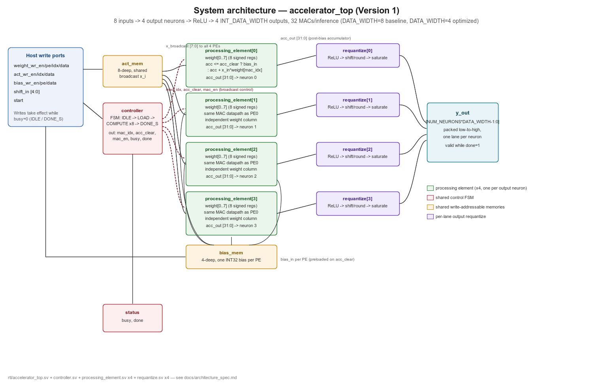
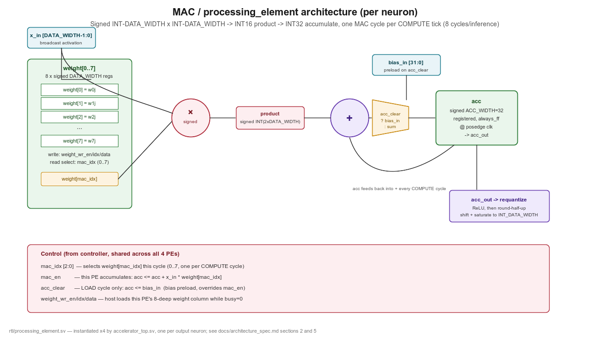
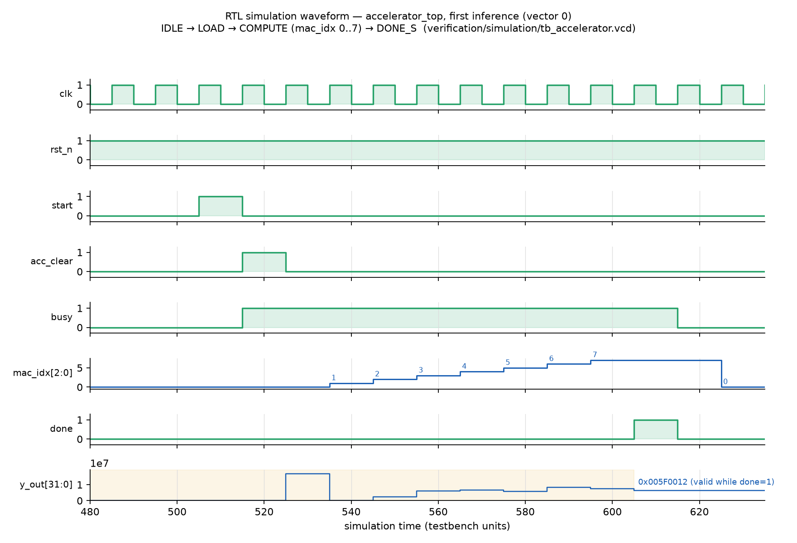
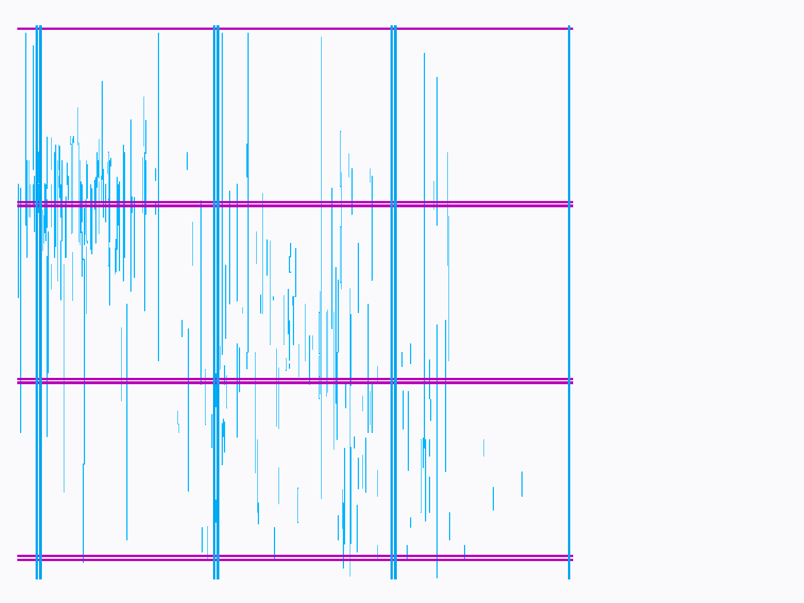
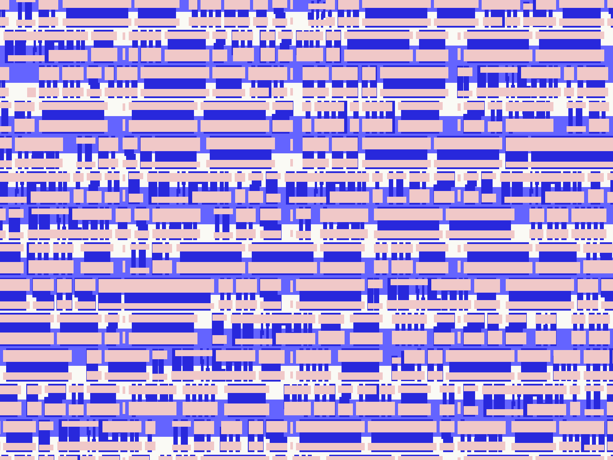
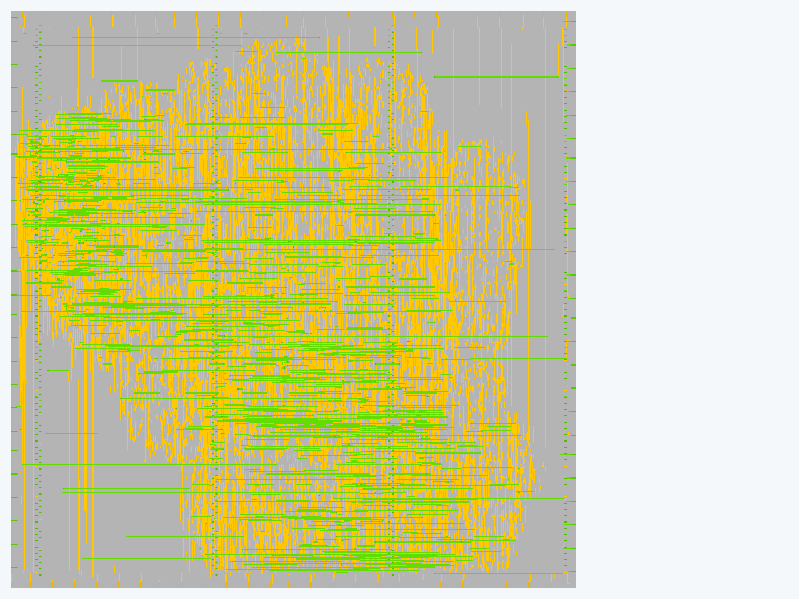
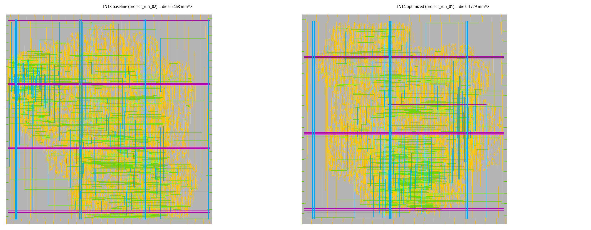
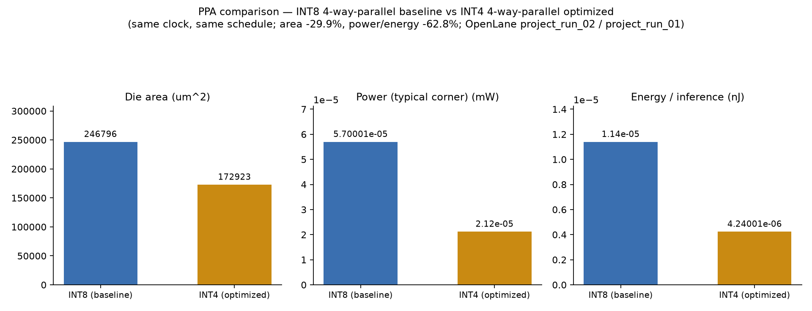
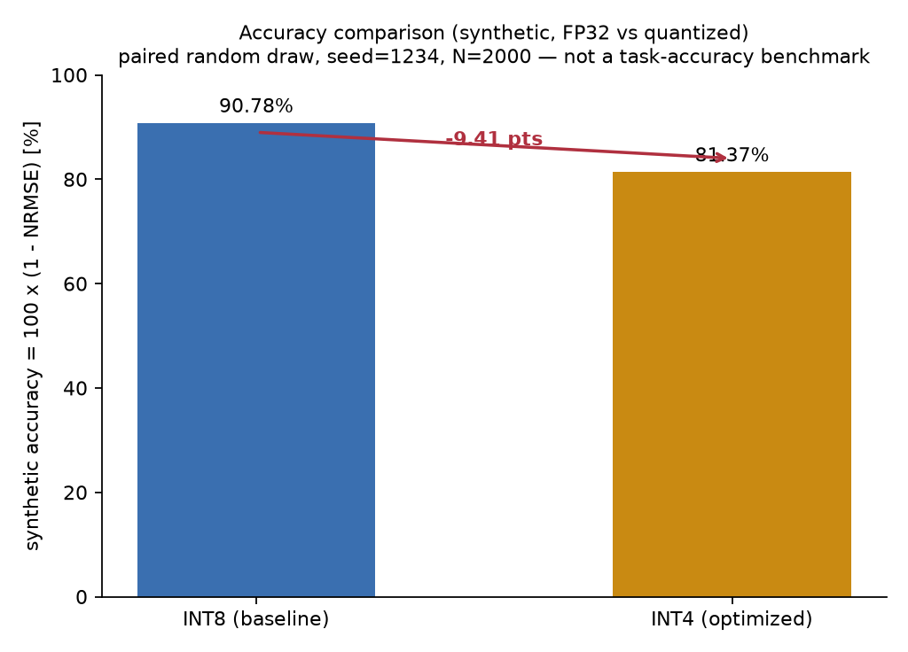
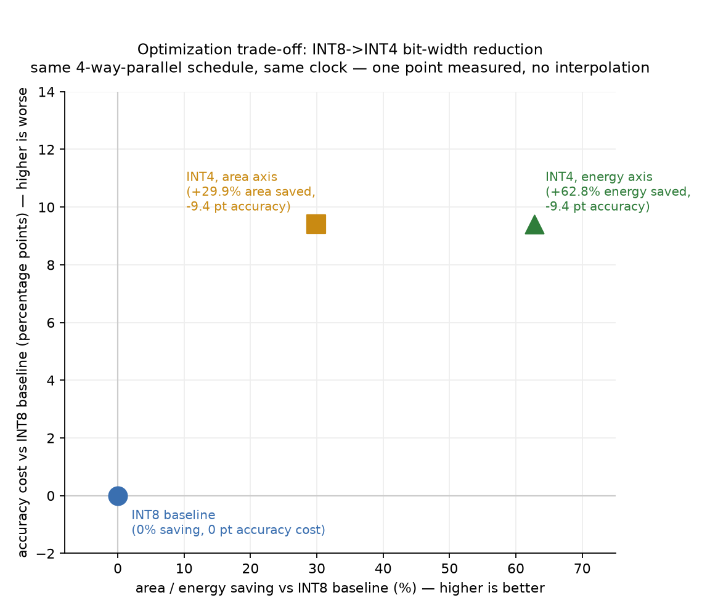

# Design and Optimization of a Low-Power CMOS Accelerator for Edge-AI Signal Processing

**A SKY130 RTL-to-GDSII study of quantized MAC architectures for a small Edge-AI accelerator**

Sprint 8 technical report · [low-power-edge-ai-asic-accelerator](../../README.md) · 2026-09-09

---

## 1. Abstract

This report documents the design, verification, and physical implementation of a small quantized neural-network accelerator (8 inputs, 4 output neurons, ReLU, 32 multiply-accumulate operations per inference) carried through a complete open-source RTL-to-GDSII flow on the SkyWater SKY130 process. The project builds a Python golden reference model, a parameterized SystemVerilog accelerator (`accelerator_top` — one processing element per output neuron, an 8-cycle sequential MAC schedule per PE, shared activation/weight/bias memories, and per-lane ReLU-and-requantize), verifies the RTL against the golden model bit-exactly on frozen test vectors, and closes two controlled hardware variants through OpenLane to signed-off, DRC/LVS-clean GDSII: an INT8 baseline and an INT4 bit-width-optimized variant, both using the identical 4-way-parallel schedule and the identical clock period. Halving the datapath width from INT8 to INT4 reduces die area by 29.9% (0.246796 mm² → 0.172923 mm²) and typical-corner power/energy-per-inference by 62.8% (57.0 nW → 21.2 nW; 0.0114 pJ → 0.0042 pJ per inference), at a cost of 9.41 percentage points on a synthetic quantization-noise accuracy metric (90.78% → 81.37%). Latency and operating frequency are held constant by design (10 cycles/inference, 50 MHz), so the study isolates the effect of numerical precision from the effect of scheduling. The sequential-schedule axis of the originally planned four-point precision × parallelism matrix was descoped early and explicitly, and this report treats that as a pre-registered scope decision rather than unfinished work. All numbers in this report are taken directly from `results/comparison.csv`, `results/int8_parallel/`, and `results/int4_parallel/`; none are estimated or extrapolated.

---

## 2. Introduction

Edge-AI inference accelerators trade off numerical precision, hardware parallelism, silicon area, power, and inference accuracy against each other, and the right point on that trade-off surface is workload-dependent rather than universal. A resource-constrained edge device (a wearable sensor node, an always-on keyword detector, a low-rate signal-processing front end) usually cares more about energy per inference than about peak throughput, which makes energy-efficient low-precision arithmetic attractive — but only if the accompanying accuracy loss is acceptable for the task.

This project studies that trade-off directly, on real silicon-adjacent evidence rather than analytical models: a small accelerator is designed, verified at the RTL level against a Python golden model, and carried through an actual open-source ASIC flow (Yosys → OpenROAD → Magic/Netgen → KLayout, orchestrated by OpenLane) on the SkyWater SKY130 130 nm process, for two controlled hardware variants that differ in exactly one architectural parameter (activation/weight bit width). The goal is not to build a competitive commercial accelerator — the workload (8×4 GEMV, 32 MACs/inference) is deliberately tiny — but to produce a complete, honest, measured RTL-to-GDSII case study of a specific optimization technique, with every reported number traceable to a signed-off physical-design run.

---

## 3. Problem Statement

**Research question:** How do reduced numerical precision (INT8 vs. INT4) and MAC parallelism (sequential vs. 4-way parallel) affect energy-efficiency, silicon area, timing, latency, and inference accuracy of a small Edge-AI accelerator implemented in SKY130?

The project's originally planned research design was a four-point matrix (precision × parallelism): INT8-sequential, INT8-parallel, INT4-sequential, INT4-parallel. Early in the project (Sprint 6, [docs/optimization_plan.md](../optimization_plan.md)), this was deliberately reduced to a single axis — precision only, with the 4-way-parallel schedule held constant across both variants — to fit the project inside its eight-week timeline without sacrificing rigor on the axis actually measured. This report is explicit about that scope cut throughout: every claim below is about *precision at fixed parallelism*, not about parallelism, and the sequential-schedule variants are reported as an out-of-scope, unmeasured cell in the matrix, not as a missing result.

**Why this question matters:** "lower precision is more efficient" and "more parallelism is faster" are both intuitively true but analytically under-specified — they say nothing about *how much* area/power is bought for *how much* accuracy, or whether a schedule change that "looks low-power" actually wins on energy-per-inference once its cycle count is accounted for. Answering the question requires physical measurement, not a spreadsheet model: SKY130 standard-cell power, congestion-driven routing, and antenna/DRC effects do not follow a clean textbook formula, and this project's own experience (a synthesis-tool bug that would have silently mislabeled an INT8 netlist as INT4, described in Section 10) is direct evidence that "the RTL parameter changed" is not sufficient proof that "the hardware changed" — only a gate-level/physical check is.

---

## 4. Related Work

This project inherits, but does not present as its own original work, a prior open-source project's RTL/toolchain baseline: the **SiliconNPU** project (MIT-licensed, author Ansh Verma), consisting of `rtl/mac_core.sv`, `rtl/mac_core_pipelined.sv`, `rtl/silicon_npu.sv`, and associated OpenLane/Python tooling (`flow/`, `openmac/`, several `scripts/*.py`). That baseline computes a single dot product with a single scalar accumulator (`silicon_npu.sv`), uses plain unsigned SystemVerilog logic with no `signed` arithmetic anywhere, and implements neither bias, ReLU, nor requantize-to-INT8 — none of which are needed for this project's Version 1 four-output-neuron accelerator. Full attribution, an audit of the inherited RTL (three lint-clean, signed-arithmetic-corrected variants), and a documented contradiction in the original project's own two self-reported PPA tables (which disagree with each other on `mac_core`'s timing closure and on RTL test counts) are recorded in [docs/baseline_reference.md](../baseline_reference.md). The inherited baseline is retained for provenance and toolchain comparison only; it is excluded from the active simulation/lint flow, and none of the PPA numbers in this report come from it.

Beyond the inherited baseline, this project does not conduct a formal literature review of the broader INT8/INT4 quantized-accelerator or open-source-ASIC-flow research space; the "related work" in scope for this report is the project's own predecessor codebase, documented above, and the open-source toolchain itself (Yosys, OpenROAD, Magic, Netgen, KLayout, OpenLane, the SKY130 PDK), whose versions are recorded per-run in Section 9.

---

## 5. Proposed Architecture

Version 1 implements one GEMV (general matrix-vector multiply) layer plus bias and ReLU:

```
y_j = ReLU( sum_{i=0}^{7} x_i * w_ij + b_j ),   j = 0..3
```

8 inputs, 4 output neurons, 32 multiply-accumulate operations per inference. This is deliberately small — small enough to verify by hand and to close through physical implementation inside a single sprint, while still exercising a real multi-PE datapath, a shared control FSM, host-programmable weight/activation/bias memories, and a genuine quantize → compute → requantize pipeline, which is what the research question actually needs.

The chosen topology is **four parallel per-neuron processing elements**, each holding its own 8-deep weight column and its own INT32 accumulator, fed by a single shared, broadcast activation memory:



*Figure 1 — System architecture. `accelerator_top` instantiates one shared `controller` FSM, one shared 8-deep activation memory (`act_mem`, broadcast to all four PEs), one shared 4-deep bias memory, four independent `processing_element` instances (one per output neuron, each with its own 8-deep weight column), and four independent `requantize` units (ReLU + shift/round/saturate). Host write ports load weights/activations/biases while the accelerator is idle; `y_out` is a packed 4-lane bus, valid while `done=1`.*

Each processing element's weight column holds all eight weights for its neuron (`w_0j..w_7j`), not a single shared register — this directly fixes a specific error in the original technical manual this project's Sprint 2 plan was checked against, which described a weight-stationary PE with one `weight_reg` for a layer that actually needs 32 independent weights (8 inputs × 4 neurons). See [docs/architecture.md](../architecture.md)'s "Manual PE issue" section and `verification/tb_processing_element.sv`'s "Test 1: Eight independent weight registers," which specifically exercises this failure mode (writing all eight registers and checking all eight survive together, not just the last write).

---

## 6. Hardware Design

### 6.1 Module hierarchy

```
accelerator_top.sv
 ├── controller.sv            (FSM: IDLE -> LOAD -> COMPUTE -> DONE_S)
 ├── processing_element.sv  x4  (one per neuron: weight column + MAC + accumulator)
 └── requantize.sv          x4  (one per neuron: ReLU + shift/round/saturate)
```

Two folding decisions were made relative to the original Sprint 2 module list, both explicitly permitted by that sprint's plan and recorded in [docs/architecture_spec.md](../architecture_spec.md) section 1: the accumulator lives inside `processing_element.sv` (inseparable from its MAC — no benefit to a standalone module), and the weight buffer lives inside `processing_element.sv` while the input buffer lives in `accelerator_top.sv` (the input buffer is shared/broadcast to all four PEs, so it belongs at the top, not inside any one PE).

### 6.2 Processing element / MAC datapath



*Figure 2 — Single processing-element datapath. `x_in` (the broadcast activation) and `weight[mac_idx]` (this PE's own weight, selected by the shared broadcast index) feed a signed multiplier producing a signed `2×DATA_WIDTH` product; a bias-preload mux lets the shared `controller` either load the PE's bias (`acc_clear`, LOAD cycle) or continue accumulating (every COMPUTE cycle); the INT32 accumulator is a plain registered adder with no saturation logic, because the operand headroom analysis below shows it is never needed for this topology.*

Each PE's MAC is a **direct signed-multiply-accumulate**, not an instantiation of the inherited `mac_core.sv` baseline: `mac_core`'s single `IDLE→ACCUM→DONE_S` FSM computes one full dot product per `start` pulse with no bias-preload or per-cycle broadcast-index visibility, neither of which fits a PE that must expose `acc_clear`/`mac_en`/`mac_idx` to a shared controller driving four PEs in lockstep. This is a deliberate architectural choice, not an oversight — see [docs/architecture_spec.md](../architecture_spec.md) section 1.

### 6.3 Control FSM and timing

```
        IDLE        LOAD       COMPUTE (x8)         DONE_S
start ───┐
         └─────────►│
                     └─────────►│ mac_idx=0..7      │
                                 (1 MAC/cycle)       └──► (back to IDLE on !start)
```

1. Host writes weights/activations/biases while `busy=0` (IDLE or DONE_S). Writes are edge-triggered with no additional handshake; the host is responsible for not writing while `busy=1` (a deliberate Version 1 simplification, see [architecture_spec.md](../architecture_spec.md) section 3).
2. `start` asserted → FSM leaves IDLE, `busy` goes high the same edge.
3. LOAD (1 cycle): every PE's accumulator is preloaded with its bias (`acc_clear`); broadcast index resets to 0.
4. COMPUTE (8 cycles): each cycle, `mac_idx` selects one broadcast activation and each PE independently reads its own `weight[mac_idx]`; every PE accumulates `x_in * weight[mac_idx]` into its own `acc`.
5. After the 8th COMPUTE cycle, `DONE_S`: `done=1`, `y_out` (combinational ReLU + requantize of each PE's final accumulator) is valid and held stable.
6. FSM returns to IDLE on the first cycle `start` is low while in `DONE_S`.

This gives **10 clock cycles per inference** (1 LOAD + 8 COMPUTE + 1 DONE_S recognized), matching `results/comparison.csv`'s measured `cycles_per_inference=10` for both variants — the schedule is identical between INT8 and INT4 by construction (Section 10), so this number does not change with precision.

### 6.4 Memory map

| Memory | Depth | Addressed by | Data |
|---|---|---|---|
| Weights | 8 per PE × 4 PEs = 32 registers | `weight_wr_pe` (0-3), `weight_wr_idx` (0-7) | signed `DATA_WIDTH` |
| Activations | 8, shared/broadcast | `act_wr_idx` (0-7) | signed `DATA_WIDTH` |
| Biases | 4, one per PE | `bias_wr_pe` (0-3) | signed INT32 |

`weight[pe=j][idx=i]` holds `w_ij`, matching `algorithm/reference_model.py`'s `W` array layout (row-major, 8×4) exactly — this is one of the properties the bit-exact RTL/Python comparison in Section 8 actually checks, not merely documents.

### 6.5 Fixed-point format and overflow analysis

| Signal | Format |
|---|---|
| Activation, weight | signed `DATA_WIDTH` (INT8 baseline, INT4 optimized), Q(`DATA_WIDTH`-1).0 |
| Product | signed `2×DATA_WIDTH` |
| Accumulator / bias | signed INT32, no saturation |
| Output | signed `DATA_WIDTH` via round-half-up shift, then saturate |

The accumulator is fixed at 32 bits for **both** variants — this was a deliberate control (Section 10), not an oversight. Worst-case magnitude analysis: for INT8, the largest-magnitude single product is `(-128)×(-128)=16384`, and the largest-magnitude 8-term pre-bias sum is `8×16384=131072`, both far under the signed INT32 range (±2,147,483,648); for INT4, the corresponding numbers are `(-8)×(-8)=64` and `8×64=512`, with even more headroom. **No wrap or saturate logic is implemented or needed in the accumulator itself for either variant** — this is confirmed by the overflow analysis in [docs/architecture_spec.md](../architecture_spec.md) section 5, not merely assumed. The one place saturation is real and exercised is the INT8/INT4 output clip in `requantize.sv` (`[-128,127]` / `[-8,7]`), verified directly against `algorithm/quantization.requantize`'s `np.clip` on both the RTL testbenches and the Python known-answer tests.

---

## 7. RTL Implementation

The accelerator is implemented in SystemVerilog-2012 (`rtl/accelerator_top.sv`, `controller.sv`, `processing_element.sv`, `requantize.sv`), fully parameterized on `DATA_WIDTH` (default 8), `NUM_INPUTS` (8), `NUM_NEURONS` (4), `ACC_WIDTH` (32), and `SHIFT_WIDTH` (5). The INT4 variant (Section 10) reuses these exact same four files unmodified, instantiated with `DATA_WIDTH=4` — this project deliberately did not fork a second RTL copy for the optimization axis, so any measured difference between the two hardware variants is attributable to the width parameter alone, not to independently-written RTL.

The inherited baseline RTL (`rtl/mac_core.sv`, `mac_core_pipelined.sv`, `silicon_npu.sv`) was audited and corrected before this project began layering new modules on top of it: it originally had no `signed` arithmetic anywhere (all operands were plain unsigned `logic`, which multiplies a negative INT8 operand as a large unsigned value instead of two's-complement), which is incompatible with this project's symmetric-signed quantization policy ([docs/quantization.md](../quantization.md)). All three files were fixed and re-verified against updated testbenches carrying explicit signed-boundary (`INT8_MIN * INT8_MIN`) and cross-sign (`-5 * 3` must sum negative) test cases — a case an unsigned-multiply bug cannot pass by accident. Four Verilator lint findings (`WIDTHEXPAND`, `CASEINCOMPLETE`, `GENUNNAMED`, an unused localparam) were also fixed as part of this audit. See [docs/architecture_spec.md](../architecture_spec.md) section 6 for the full before/after. This baseline remains a standalone, reference-only artifact (it is not instantiated by `accelerator_top`); it is documented here because its audit was a real, verified piece of this project's RTL work, not because its numbers appear in the physical-design results below.

**Quantization policy:** symmetric signed quantization, zero-point 0, for both activations and weights (`docs/quantization.md`), avoiding the asymmetric unsigned-activation / signed-hardware mismatch that the original technical manual's mixed scheme would have introduced as a bit-exact verification trap. INT4 uses the identical symmetric rule at `n=4` (`q_max=7`), not a different quantization scheme.

---

## 8. Verification

The project enforces three mandatory validation levels — mathematical (Python), RTL (simulation bit-exact against Python), and physical (a real OpenLane run to GDSII) — and does not allow later levels to substitute for earlier ones (`docs/verification.md`).

**Level 1 — Mathematical.** `algorithm/reference_model.py` implements the 8×4 GEMV + bias + ReLU + requantize pipeline generically over bit width; `algorithm/tests/test_reference_model.py` has 12 known-answer checks (8 INT8 + 4 INT4: zeros, negatives, bias-only, near-overflow, saturation), all passing. Five deterministic seeded vectors are frozen per bit width (`verification/reference/vectors.csv` / `vectors_int4.csv`, seed 1234), and `scripts/check_reference_vectors.py` confirms every row against `algorithm/reference_model.forward()` — 5/5 for each width.

**Level 2 — RTL.** Hierarchical Icarus Verilog testbenches, run via `scripts/run_sim.sh`:

| Testbench | Result | Notes |
|---|---|---|
| `verification/mac_core_tb.sv` (inherited baseline) | 7/7 pass | includes signed-boundary/cross-sign cases added during the audit |
| `verification/mac_core_pipelined_tb.sv` (inherited) | 6/6 pass | |
| `verification/silicon_npu_tb.sv` (inherited) | 5/5 pass | |
| `verification/tb_processing_element.sv` | 4/4 pass | includes the eight-independent-weight-registers test |
| `verification/tb_accelerator.sv` (INT8) | 5 vectors × 4 neurons, accumulator + output checks, all pass | Sprint 3 full sweep; Sprint 2 had run 3/5 as a smoke test |
| `verification/tb_accelerator_int4.sv` (INT4) | 25/25 checks (5 vectors × (4 neurons + 1 busy-drop check)) pass | Sprint 6, bit-exact against `reference_model.forward(..., bits=4)` |
| `requantize.sv` standalone | 8/8 direct checks | shift=0 pass-through, saturation both directions, round-half-up at an exact `.5` boundary |

Every check above compares against `algorithm/reference_model.forward()`'s actual computed output for that vector, not a hand-derived expected value — including a vector that hits the INT8_MIN (-128) weight boundary and vectors that exercise ReLU-zeroing on 2 of 4 outputs. Verilator `--lint-only -Wall` is clean (zero warnings) on the full active RTL hierarchy, run before every OpenLane synthesis attempt.

Figure 3 shows the actual simulated waveform for the first inference of the INT8 accelerator testbench, parsed directly from the checked-in VCD (not redrawn from a description):



*Figure 3 — `tb_accelerator.sv`, vector 0. `start` triggers `acc_clear` (bias preload) one cycle later, then `mac_idx` sweeps 0→7 over the 8 COMPUTE cycles while `busy=1`; `done` pulses once `y_out` (shown here as its raw 32-bit packed hex value, `0x005F0012`) is valid. This matches the FSM/timing description in Section 6.3 cycle-for-cycle.*

One verification pitfall worth recording: an early version of `tb_accelerator.sv` had a testbench race (stimulus driven immediately after `@(posedge clk)` without a `#1` delay raced the DUT's own `always_ff` sampling on the same edge), which manifested as a rotate-by-one weight-loading bug — caught by comparing per-neuron accumulators against the Python golden vector, not by the final output alone. See [docs/architecture_spec.md](../architecture_spec.md) section 7's note on testbench races.

**Level 3 — Physical.** Covered in Section 9.

---

## 9. ASIC Implementation

Both variants were carried through the identical local OpenLane v1.0.2 install, SKY130A / `sky130_fd_sc_hd` standard-cell library, with identical flow settings:

| Setting | Value |
|---|---|
| `CLOCK_PORT` | `clk` |
| `CLOCK_PERIOD` | 20 ns (50 MHz) |
| `FP_CORE_UTIL` | 35 |
| `PL_TARGET_DENSITY` | 0.50 |
| `SYNTH_STRATEGY` | `AREA 0` |

### 9.1 INT8 baseline (`int8_parallel`, `project_run_02`)

Closed through GDS, LVS, DRC, ARC, and ERC. DRC, LVS, KLayout-vs-Magic XOR, TritonRoute, and setup/hold checks are all clean (0/0). 23 pin and 19 net antenna violations and max-fanout warnings are reported and documented, not silently dropped (`results/int8_parallel/signoff.md`). Die area 0.246796414625 mm² (229,900.49 µm² core), 28,761 total cells, critical path 7.98 ns at the 20 ns period (worst setup slack 3.74 ns, worst hold slack 0.16 ns per the root README's summary).



*Figure 4 — INT8 baseline die outline and top-level power distribution network (met4/met5 straps and rings), rendered directly from the signed-off `results/int8_parallel/accelerator_top_project_run_02.gds`.*



*Figure 5 — INT8 baseline standard-cell placement detail: diffusion/poly/nwell layers only, zoomed to a ~17 µm window (roughly six standard-cell rows) so individual placed gates are visible, rather than the sub-pixel aliasing that these layers produce at full-die scale.*



*Figure 6 — INT8 baseline signal routing (met1-met3 + vias), full die.*

### 9.2 INT4 optimized (`int4_parallel`, `project_run_01`)

Same flow, same clock, `DATA_WIDTH=4`. Also DRC/LVS/XOR/route/setup-hold clean. Die area 0.172923286025 mm² (158,562.07 µm² core), 20,157 total cells, critical path 7.47 ns at the same 20 ns period, 14 pin and 11 net antenna violations (fewer than INT8's 23/19, consistent with a smaller design but not separately investigated).

### 9.3 Final layout comparison



*Figure 7 — Signed-off final GDSII, INT8 baseline (left) vs. INT4 optimized (right), same rendering scale conventions. The area reduction is visible directly in the die outline, not only in the metrics table.*

### 9.4 Why an INT4 wrapper module exists

`designs/accelerator_int4_parallel/config.json` was originally staged (Sprint 6) using OpenLane's `SYNTH_PARAMETERS: ["DATA_WIDTH=4"]`, relying on Yosys's `chparam` mechanism to override the width at synthesis time. This was explicitly flagged as unverified before running. Running it in Sprint 7 confirmed the risk was real, and worse than "silently does nothing": synthesis's own log showed the parameter override "taking effect" (`$paramod\accelerator_top\DATA_WIDTH=...4` appeared), but the final Yosys `check` pass found the top-level `y_out`, `busy`, and `done` completely undriven, and the flow errored out. Reproduced independently in standalone Yosys 0.33 two ways (a hierarchy-cache assertion crash, and a silent flatten failure that leaves submodule instances opaque and undriven) — see `results/int4_parallel/signoff.md` for exact commands. The fix was **not** to patch the shared RTL, but to add `designs/accelerator_int4_parallel/accelerator_top_int4.sv`, a thin wrapper that instantiates `accelerator_top #(.DATA_WIDTH(4))` through an ordinary Verilog parameter override — no `chparam` involved — which synthesizes cleanly. This was confirmed to produce a genuine INT4 netlist (not an INT8 netlist mislabeled): the synthesized `y_out` port is `[15:0]` (4×4, not INT8's 32 bits), driven by real standard-cell output pins, and both die area and total cell count dropped substantially and independently of the labeling.

This finding matters beyond this one run: it is direct, reproduced evidence that a parameter-sweep technique which "looks fine" in a synthesis tool's own log can still produce a broken or mislabeled netlist, and that only a gate-level check (driven-ness of the top-level ports, port widths, cell counts) — not visual inspection of the log — catches it. See Section 13 for the discussion implication.

---

## 10. Optimization Method

**Technique:** INT8 → INT4 datapath bit-width reduction, on the same MAC architecture and schedule already closed through GDSII (Section 9.1) — the 4-way-parallel, 8-sequential-MAC-cycle-per-PE schedule described in Section 6.3. Chosen and pre-registered in Sprint 6 ([docs/optimization_plan.md](../optimization_plan.md)) **before** any Sprint 7 measurement was taken.

**Hypothesis, stated in advance:** halving activation/weight width should shrink the per-PE multiplier and its switching activity (smaller partial-product tree), likely reducing area and dynamic power; should **not** change latency (the schedule — `NUM_INPUTS=8` COMPUTE cycles — does not depend on operand width); and should **degrade accuracy**, because INT4 has a 16× coarser quantization step over the same represented range. All three predictions are checked against the Section 12 results, not assumed to hold.

**What was held constant (the controls):** RTL module set (the same four files, only the `DATA_WIDTH` parameter differs); `ACC_WIDTH=32` (deliberately not shrunk, so the accumulator's extra headroom at INT4 costs nothing and the comparison stays single-variable); `NUM_INPUTS`/`NUM_NEURONS` (8/4); PDK and standard-cell library; OpenLane major version (v1.0.2 for both runs); `CLOCK_PERIOD` (20 ns for both, not re-targeted for INT4 despite its larger timing slack — see Section 13); golden-model method (symmetric signed quantization, same policy, `n=4` instead of `n=8`); vector-generation seed and procedure (seed 1234, same call shape).

**What changed (the one variable):** `DATA_WIDTH` (8→4); activation/weight/output range (`[-128,127]`→`[-8,7]`); the frozen test vectors' requantize shift (8→4, an empirically re-picked Python-side test-tooling constant, not an RTL parameter — chosen so the smaller INT4 dynamic range still exercises a spread of outputs rather than saturating on every vector); the bias sampling range used only for generating test vectors (`[-1000,1000)`→`[-4,4)`, so the bias remains a small perturbation relative to the GEMV term at INT4's much smaller accumulator headroom, rather than swamping it on every vector — again a test-generation decision, not a hardware change, since the bias port itself stays signed INT32 in both variants).

**Implementation:** no new MAC/PE/controller/requantize RTL was written. `algorithm/quantization.py` gained a generic `qrange(bits)`/`requantize(acc, shift, bits=8)`, with the existing `requantize_int8` kept as a thin `bits=8` wrapper for backward compatibility; `algorithm/reference_model.py`'s `forward()` gained a `bits` parameter; `algorithm/generate_vectors.py` gained `bits`/`bias_range` parameters and now also emits `verification/reference/vectors_int4.{csv,hex}`; `verification/tb_accelerator_int4.sv` is a new, structurally identical testbench instantiating `accelerator_top` with `DATA_WIDTH=4`. The physical-design side required the wrapper module described in Section 9.4.

---

## 11. Experimental Setup

| Control | INT8 baseline | INT4 optimized |
|---|---|---|
| Top module | `accelerator_top` | `accelerator_top_int4` (wrapper around `accelerator_top #(.DATA_WIDTH(4))`) |
| OpenLane run tag | `project_run_02` | `project_run_01` |
| OpenLane version | v1.0.2 | v1.0.2 |
| PDK / library | SKY130A / `sky130_fd_sc_hd` | SKY130A / `sky130_fd_sc_hd` |
| `CLOCK_PERIOD` | 20 ns (50 MHz) | 20 ns (50 MHz) |
| `FP_CORE_UTIL` / `PL_TARGET_DENSITY` / `SYNTH_STRATEGY` | 35 / 0.50 / `AREA 0` | 35 / 0.50 / `AREA 0` |
| Golden-model method | symmetric signed, seed 1234 | symmetric signed, seed 1234, n=4 |
| Accuracy measurement | `algorithm/measure_accuracy.py`, paired random draw, N=2000 | same script, same paired draw, only bits/shift differ |

**Fairness checklist** (from [docs/ppa_comparison.md](../ppa_comparison.md), reproduced here because it is the actual methodological guarantee behind Section 12's comparison): same PDK; same OpenLane major version; same `CLOCK_PERIOD`, unchanged intentionally; same golden-model method for the accuracy figure (same seed, same paired random draw, only bit width and shift differ); power taken from the same class of report (typical corner, internal+switching+leakage, both runs); area from the same definition (`DIEAREA_mm^2` from OpenLane's own metrics report, both runs); run tags recorded for every variant.

**Accuracy metric definition, stated precisely because it is easy to over-claim:** `accuracy_pct` is computed from paired random float32 activations/weights/bias (same draw for both bit widths, seed 1234, N=2000), symmetric per-tensor quantization at a fixed static scale, run through the bit-exact golden pipeline, compared against the unquantized float32 forward pass via NRMSE: `accuracy_pct = 100 × (1 − NRMSE)`, clipped to `[0,100]`. This project has not adopted a real dataset or task ([docs/research_question.md](../research_question.md)); treat the 90.78%/81.37% figures as *how much quantization noise this scheme introduces on random data*, not as *this accelerator is 81–91% accurate at some task*.

---

## 12. Results

| Design | Precision | MAC arch. | Die area (µm²) | Power, typ. (mW) | Critical path (ns) | Cycles/inference | Frequency (MHz) | Energy/inference (nJ) | Accuracy* (%) |
|---|---|---|---:|---:|---:|---:|---:|---:|---:|
| Adder (Exp. 0) | n/a | n/a | 2,577.88 | n/a | 1.67 | n/a | n/a | n/a | n/a |
| **int8_parallel (baseline)** | INT8 | 4-way parallel | 246,796.41 | 0.0000570001 | 7.98 | 10 | 50 | 0.0000114000 | 90.7775 |
| **int4_parallel (optimized)** | INT4 | 4-way parallel | 172,923.29 | 0.0000212000 | 7.47 | 10 | 50 | 0.0000042400 | 81.3711 |
| Change (INT8→INT4) | — | — | **-29.93%** | **-62.81%** | -6.4% (informational) | 0% (controlled) | 0% (controlled) | **-62.81%** | **-9.41 pts** |

\*Synthetic quantization-noise accuracy, see Section 11. Full precision and every source column: [`results/comparison.csv`](../../results/comparison.csv).



*Figure 8 — Die area, typical-corner power, and energy per inference, INT8 baseline vs. INT4 optimized.*



*Figure 9 — Synthetic accuracy, INT8 baseline vs. INT4 optimized. -9.41 percentage points.*



*Figure 10 — The measured trade-off: one point (INT8→INT4), plotted on both its area-saving and energy-saving axes against its accuracy cost. This is a single measured operating point, not an interpolated Pareto curve — the project has not measured any intermediate bit width.*

**Energy equals power improvement, exactly (-62.81% both), and this is expected, not a coincidence.** Cycle count and operating frequency are unchanged by design (both controls), so `E = P × t` with `t` identical between variants makes the two percentages algebraically the same. This is the fairness checklist's "same `CLOCK_PERIOD`" control working as intended.

**Critical path is reported as informational only, not a controlled result.** STA reports 7.98 ns (INT8) vs. 7.47 ns (INT4) at the identical 20 ns period — INT4 has more timing slack, consistent with a smaller multiplier, but this project did not re-target a faster clock for INT4 (the same period was a deliberate control, per Section 10), so this is not reported as a frequency or throughput improvement. A tighter-period re-close of INT4 (and, for a fair comparison, of INT8 too) is future work, not something this report claims credit for.

All three of Section 10's pre-registered predictions held: area and power/energy both improved substantially (~30% and ~63%) from halving the datapath; latency (cycles/inference) did not change (10 for both, by construction); accuracy measurably degraded (9.41 points on the synthetic metric).

### 12.1 Final package completeness

The eight-week sprint plan's final deliverable list ([docs/02_eight_week_sprint_plan.md](../02_eight_week_sprint_plan.md)) has 15 items. Status of each, with its evidence location, so this can be checked rather than taken on faith:

| # | Item | Status | Evidence |
|---|---|---|---|
| 1 | Working Python reference model | Done | `algorithm/reference_model.py`, 12/12 known-answer tests |
| 2 | Working Verilog/SystemVerilog RTL | Done | `rtl/accelerator_top.sv` + 3 submodules |
| 3 | Verified testbench | Done | `verification/tb_accelerator.sv`, `tb_accelerator_int4.sv`, `tb_processing_element.sv` |
| 4 | Simulation waveforms | Done | `verification/simulation/*.vcd` (gitignored raw files, regenerated by `scripts/run_sim.sh`); rendered in Figure 3 |
| 5 | Synthesized netlist | Produced and inspected, not curated as a checked-in file | Verified during Sprint 7 (port widths, driven-ness — Section 9.4); the raw netlist lives in OpenLane's gitignored `runs/` tree per this project's "curated artifacts only" policy ([results/README.md](../../results/README.md)), not copied into `results/` |
| 6 | Baseline PPA | Done | `results/int8_parallel/metrics.csv`, `signoff.md` |
| 7 | Optimized RTL | Done | Same 4 files, `DATA_WIDTH=4` + `accelerator_top_int4.sv` wrapper |
| 8 | Optimized PPA | Done | `results/int4_parallel/metrics.csv`, `signoff.md` |
| 9 | RTL-to-GDSII flow | Done, both variants | OpenLane v1.0.2, Section 9 |
| 10 | Final GDSII | Done, both variants | `results/int8_parallel/*.gds`, `results/int4_parallel/*.gds` |
| 11 | DRC/LVS/signoff evidence | Done, both variants | `results/int8_parallel/signoff.md`, `results/int4_parallel/signoff.md` |
| 12 | Baseline vs. optimized comparison | Done | `results/comparison.csv`, [docs/ppa_comparison.md](../ppa_comparison.md), Section 12 above |
| 13 | Technical report | Done | This document |
| 14 | GitHub repository | Done | This repository, curated per [docs/github_and_lab_notebook.md](../github_and_lab_notebook.md) |
| 15 | Architecture + results figures | Done | [docs/figures/](../figures/), 10 figures + 3 supplemental |

**Explicitly N/A, with reason:** sequential-schedule PPA/GDSII for `int8_sequential`/`int4_sequential` — out of scope, descoped in Sprint 6 (Section 3), not attempted. CV/SOP paragraph — gated on adopting a real dataset, per [docs/research_methodology.md](../research_methodology.md); not written because that condition is unmet, not because it was forgotten.

---

## 13. Discussion

**On the trade-off itself.** A ~30% area saving and a ~63% power/energy saving for a ~9.4-point synthetic-accuracy cost is a substantial win on the hardware axes for a plausible cost on the accuracy axis — but this report deliberately does not declare a winner, because "is a 9.4-point accuracy drop acceptable" is a task-dependent judgment call this project cannot make without a real workload or dataset (Section 11). What this report *can* say is that the two hardware axes moved together and by a similar relative magnitude (consistent with both being driven by the same shrunk multiplier and reduced switching activity), while the accuracy axis moved independently and in the expected direction — which is exactly the shape of trade-off the pre-registered hypothesis predicted, not a surprise result.

**On the synthesis-tool finding (Section 9.4).** The `chparam` failure is a methodological result in its own right, not just an implementation footnote: a parameter-sweep technique that "looks correct" in a tool's own log (the override visibly "took effect") produced a netlist with completely undriven top-level outputs. The check that caught it was a gate-level property (are these ports actually driven, does the port width match, did the cell count change plausibly) — not a re-read of the log, and not a rerun with a different random seed. Any future extension of this project's design-space sweep (a third or fourth bit width, or the descoped sequential axis) should budget for this kind of check as a standard step, not an exceptional one.

**On the scope cut.** Reducing the four-point matrix to one axis (Section 3) was a pre-registered decision (Sprint 6, before any Sprint 7 number existed), not a post-hoc excuse for an incomplete result. The report treats the sequential-schedule variants the same way `results/comparison.csv` and the root README now do: as an explicitly out-of-scope cell, not a blank TBD implying an unfinished measurement.

**On what "energy-efficient" means here.** The project's own methodology doc warns that a sequential schedule can "look low power on a wattmeter and still lose on energy-per-inference if it takes many more cycles" — this report cannot check that claim (the sequential axis was not built), but it is worth stating plainly that the INT8-vs-INT4 comparison above says nothing about sequential-vs-parallel, and should not be read as implying a conclusion about scheduling.

---

## 14. Limitations

- **Tiny network.** 8 inputs → 4 neurons, 32 MACs/inference, one layer. This is sufficient to exercise a genuine multi-PE datapath and a full RTL-to-GDSII flow, but the measured PPA numbers do not extrapolate to a larger network — a wider or deeper accelerator would have a materially different area/power/routing-congestion profile, and this project has not measured one.
- **Academic OpenLane/SKY130 flow, not a production flow.** `FP_CORE_UTIL=35`, `PL_TARGET_DENSITY=0.50`, and `SYNTH_STRATEGY=AREA 0` were chosen to get a design closed inside course-project time, not tuned for best achievable PPA; both variants share these settings, so the *comparison* between them is fair, but neither number should be read as "the best this design can do" in absolute terms.
- **No silicon.** No tapeout, no fabrication, no post-silicon measurement. All power and timing numbers are OpenLane/OpenSTA/OpenROAD estimates from static analysis and extracted parasitics, not measured on a die.
- **STA/power-model uncertainty.** IR-drop analysis ran without `VSRC_LOC_FILES` defined (both variants, documented in each `signoff.md`), so IR-drop numbers specifically may be inaccurate; antenna violations (23/19 pin/net for INT8, 14/11 for INT4) and max-fanout warnings are present and documented, not resolved, in both signed-off runs.
- **Dataset limits.** The accuracy figure is a synthetic quantization-noise metric on random paired data (Section 11), not a task-accuracy number on any real dataset — this project has not adopted one. The CV/SOP paragraph in [docs/research_methodology.md](../research_methodology.md) remains explicitly gated on that not-yet-made decision, and this report does not use accuracy language beyond what the synthetic metric supports.
- **One optimization axis, one measured point.** The sequential-schedule variants were descoped (Section 3); the precision axis itself was only measured at two points (INT8, INT4) with no intermediate bit width, so Figure 10 is a single measured trade-off point, not a curve.
- **Single run per variant.** Each variant was synthesized and placed-and-routed once; no seed sweep or run-to-run variance data exists for either the INT8 or INT4 result.

---

## 15. Conclusion

This project carried a small, fully-verified quantized neural-network accelerator through a complete open-source RTL-to-GDSII flow on SKY130, for two controlled hardware variants differing in exactly one parameter (INT8 vs. INT4 datapath width, identical 4-way-parallel schedule and clock). Every stage — Python golden model, bit-exact RTL verification, synthesis, placement, routing, DRC/LVS/antenna signoff, and final GDSII — is backed by evidence checked into this repository, not asserted. The measured result is a genuine trade-off, not a declared winner: INT4 buys a 29.9% area reduction and a 62.8% power/energy-per-inference reduction at the cost of 9.41 points on a synthetic accuracy metric, with latency and frequency held constant by experimental design. A synthesis-tool bug encountered and fixed along the way (Section 9.4) is itself evidence for the report's broader methodological stance: claims about hardware need a hardware-level check, and this project's own gate-level verification — not visual inspection of a tool's log — is what caught a case where that would otherwise have silently failed.

---

## 16. Future Work

- Close the descoped sequential-schedule variants (`int8_sequential`, `int4_sequential`) to complete the original four-point precision × parallelism matrix.
- Re-close INT4 (and, for fairness, INT8) at a tighter `CLOCK_PERIOD`, converting INT4's measured extra timing slack (7.47 ns vs. 7.98 ns critical path at the same 20 ns period) into an actual frequency/throughput number, rather than leaving it as the informational-only observation in Section 12.
- Adopt a small real dataset (or a trained toy model) so accuracy can be reported as task accuracy rather than synthetic quantization noise, per the explicit condition in [docs/research_methodology.md](../research_methodology.md); only then fill in the CV/SOP paragraph that document defers.
- Investigate the antenna violations (23/19 pin/net INT8, 14/11 INT4) and max-fanout warnings that both signed-off runs carry as documented-but-unresolved.
- Re-run IR-drop analysis with `VSRC_LOC_FILES` defined, since the current signoff explicitly flags that omission as a source of inaccuracy.
- A third or fourth bit-width point (e.g. INT6, INT2) would turn Figure 10 from a single measured point into an actual trade-off curve.

---

## 17. References

1. This repository's own documentation set (primary sources for every claim above): [docs/00_project_overview.md](../00_project_overview.md), [docs/research_question.md](../research_question.md), [docs/research_methodology.md](../research_methodology.md), [docs/architecture.md](../architecture.md), [docs/architecture_spec.md](../architecture_spec.md), [docs/quantization.md](../quantization.md), [docs/verification.md](../verification.md), [docs/verification_report.md](../verification_report.md), [docs/physical_design.md](../physical_design.md), [docs/optimization_plan.md](../optimization_plan.md), [docs/ppa_comparison.md](../ppa_comparison.md), [docs/baseline_reference.md](../baseline_reference.md).
2. Measured data: [results/comparison.csv](../../results/comparison.csv), [results/int8_parallel/](../../results/int8_parallel/), [results/int4_parallel/](../../results/int4_parallel/), [results/baseline/](../../results/baseline/).
3. SiliconNPU (inherited baseline RTL/toolchain), Ansh Verma, MIT License — no source repository URL was recorded in the original project's own documentation to cite here; see [docs/baseline_reference.md](../baseline_reference.md) for the full attribution as preserved from the original `README_baseline.md`.
4. SkyWater Technology, SKY130 open-source PDK (`sky130A`, `sky130_fd_sc_hd` standard-cell library).
5. Toolchain: Yosys (RTL synthesis), OpenROAD (floorplan/placement/CTS/routing/STA), Magic (DRC/GDS), Netgen (LVS), KLayout (GDS viewing/XOR/rendering), OpenLane (flow orchestration, v1.0.2 for both variants in this report), Icarus Verilog and Verilator (RTL simulation and lint).

---

*End of report. Figures: [docs/figures/](../figures/) (index and provenance in [docs/figures/README.md](../figures/README.md)). Data: [results/comparison.csv](../../results/comparison.csv).*
